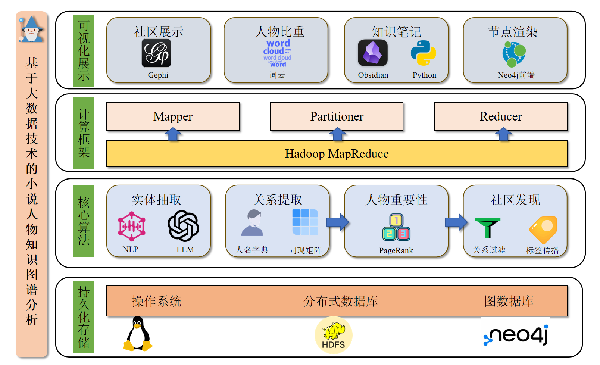
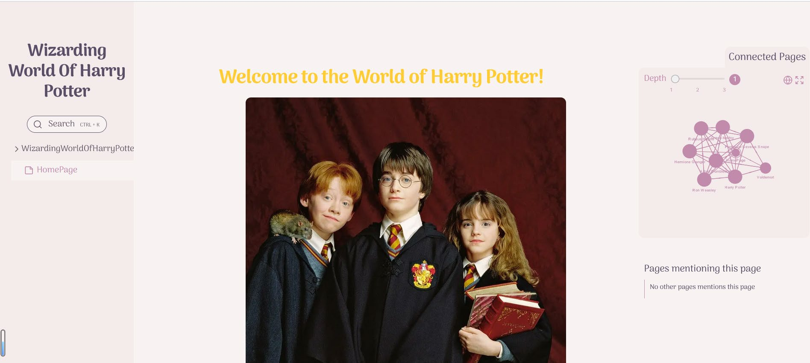
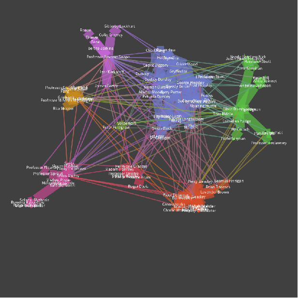

# CKG4j: Character Knowledge Graph with Neo4j

使用分布式数据系统快速构建您的人物知识图谱。



## 项目简介
本项目基于分布式文件系统`hdfs`，使用`mapreduce`技术可以快速完成对长文本内容的实体抽取、基于词频同现的关系提取、基于`pagerank`算法计算人物重要性、基于改进标签传播算法实现人物社区分析等，并利用`neo4j`完成人物关系图谱的构建和持久化存储，使用`Obsidian`等软件快速完成您的知识图谱可视化展示。



## 快速开始
在使用本项目前，您需要提前部署好`python`和`hadoop`环境，本项目推荐在Linux机器上部署。

### 1. 部署hadoop环境

可以参照这篇博客在本机部署`hadoop`:[Linux（阿里云）安装Hadoop(详细教程+避坑)](https://blog.csdn.net/qq_47831505/article/details/123806514)

如果你的选择是在远程服务器上部署`hadoop`，在本地浏览hdfs文件系统网页时，可能会遇到获取/下载文件内容失败的情况，这两个链接可能会有帮助：
+ [记一次HDFS Web报错Couldn‘t preview the file. NetworkError: Failed to execute ‘send‘ on ‘XMLHttpRequest‘](https://blog.csdn.net/llwy1428/article/details/112168574)


+ [在Web端查看hadoop对应服务器时，出现无法浏览文件内容和无法下载文件的情况](https://blog.csdn.net/blcurtain/article/details/119797137)

然后

你可能需要使用命令：
```bash
hadoop dfsadmin -safemode leave
```
来关闭`hadoop`的`safemode`模式，以确保分布式文件系统的文件能被顺利删除。
### 2.部署python虚拟环境

推荐使用`conda`进行部署:

```
conda create -n ckg4j python=3.10;

conda activate ckg4j

pip install -r requirements.txt
```

### 3. 配置环境变量

这一步是可选项，主要是为了设置项目的根目录：
```bash
export CKG4J_ROOT="你的项目目录"
```
若不设置，则默认根目录是当前文件夹，所有对本地文件/分布式文件系统文件的操作都默认在当前文件夹下进行。

！！！重要：**由于本项目代码设计到对文件系统的增删，最好请确保运行项目时，终端处于项目目录下/正确设置CKG4J_ROOT，防止误删其它文件**。

### 4. 更改配置

在成功部署分布式系统环境后，您需要修改一下两个模板文件：

+ `basic_settings_template.yaml`：请将此文件名称改为`basic_settings.yaml`，并完成对下面几个变量的设置：
```yaml
hadoop_streaming_path: "/opt/hadoop/share/hadoop/tools/lib/hadoop-streaming-3.1.3.jar"
hadoop_hdfs_url: "hdfs://0.0.0.0:9000"

hdfs_user: "amax"
hdfs_url: "http://0.0.0.0:50070"

# 非必须，目前只需要在实体过滤时使用LLM的情况下设置
openai_api_key: ""
openai_api_base: ""
openai_api_model: ""

LOG_DIR: "logs"
```

+ `task_settings_template.yaml`：请将此文件名称改为`task_settings.yaml`。每个任务的参数如下示例：
```yaml
task1:
  enable: true # 是否在pipeline中运行该阶段，默认是所有阶段都要运行
  args: # 每个任务阶段的参数，推荐使用默认参数
    overwrite: true
    ...
```

### 5. 运行pipeline

为了正确提取人物同现关系和人物社区划分，本项目的核心逻辑是将人物划分为几个阶段：

+ task0: 人名实体抽取及过滤（不太准确，建议自行给出需要分析的人名字典）
+ task1：人物词频统计
+ task2：人物同现关系构建
+ task3：人物同现关系归一化
+ task4：基于`pagerank`的人物重要性计算
+ task5：基于最小生成树算法的人物关系剪枝
+ task6：基于标签传播算法的人物社区划分

本项目提供了脚本`src/run_pipeline.py`支持一键运行全部/某些阶段任务，该脚本说明如下：

输入：
+ `--character_json`: 存放人名字典的路径，关系构建将基于这些人名展开。若指定task0运行，则无需指定该路径，程序将自动读取task0的输出。
+ `--input_dir`: 输入文件夹，该文件夹下的所有文件应该是你要进行关系构建的文本文档，建议放在项目根目录的`data`文件夹下。
+ `--output_dir`: 输出文件夹，该文件夹存放各个阶段的输出。

一个示例的运行命令是：
```bash
python src/run_pipeline.py --input_dir data/hp/files --character_json data/hp/character.json --output_dir data/hp/output
```

你将会在本地文件夹及`hdfs`系统上相同路径上看到所有输入和输出。

项目给出了两个示例的`sample`文件夹，你可以在`data/hp`和`data/test`中看到输入和输出示例。

此外，每个阶段的任务可以单独运行，其原理和命令在`src/taskX/README.md`下可查看，**强烈推荐**运行项目前先仔细阅读这些文档。

## 未来计划

### 1. 增加实体抽取流程（已完成）

现阶段的人名列表是用户自定义给出的，未来计划用自然语言处理工具抽取人物实体，并给出人名列表。

本阶段的目标是根据输入文本提取任人名字典，预期输出如下：
```json
{
    "张三": "张三",
    "张三的外号": "张三",
    "张三的昵称": "张三",
    "李四": "李四",
    "李四的外号": "李四",
    ...
}
```

我们希望对于长文本的实体抽取仍可以用`hadoop streaming`来实现，并且由于实体抽取的实体可能杂乱无章，包含人物的各种别称等，我们希望抽取后的初步结果可以调用大语言模型来进一步校验，得到最终的人名列表。

可以新增一个前置`task`阶段来完成自动提取人名列表，不需要用户手动给出。

### 2. 连接Neo4j
对于`task6`的输出：

社群关系（`task6`）：
```
人物#是否为边缘节点#所属社区名
```

和邻接关系（`task6`输出的`graph_0`）：
```
人物#邻居1@权重1|邻居2@权重2|...#节点影响系数
```

我们希望使用`neo4j`（版本暂定`5.3.0`）来实现关系图谱的持久化存储、查询和可视化展示。

可以在`src/script`下写脚本或单独在源代码部分实现一个模块，实现对指定社群关系和邻接关系文件的`neo4j`数据库连接和存储。

### 3. 人物信息生成

只有人物邻接关系的知识图谱显然是单调的，我们希望：

+ 使用搜索引擎/爬虫脚本自动化完成对人物基本信息（最好包含图片）的抓取

+ 使用`LLM`对这些信息进行整合（可选），使得人物信息更加规范

+ 基于上述信息为每个人物生成markdown文件：
```markdown
# 张三
## 人物简介

    张三的图片（外链形式，也可以下载到本地引用）

    张三，姓张名三...（爬取到的人物名字）

## 相关角色

（`task6`输出的邻接关系）

[[李四.md]] （这是markdown文件互相引用的格式，某些软件例如`Obsidian`可以进行知识图谱渲染）
[[王五.md]]
```

+ 使用`Obsidian`展示收集到的人物文件夹。

### 4. 其它可视化展示

我们希望使用`Gephi`等软件、词云等工具展示人物关系图谱和人物重要性，例如：


