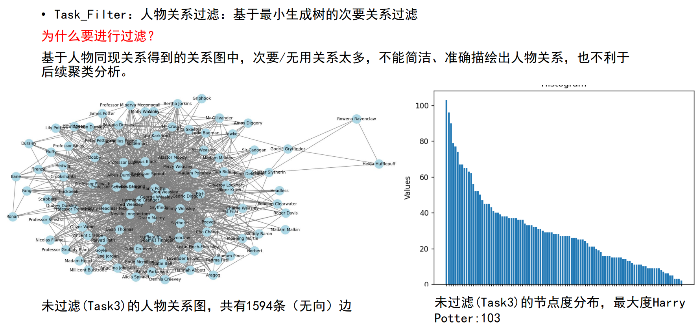
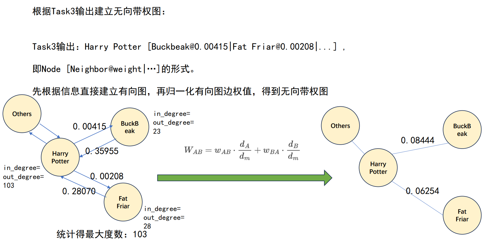
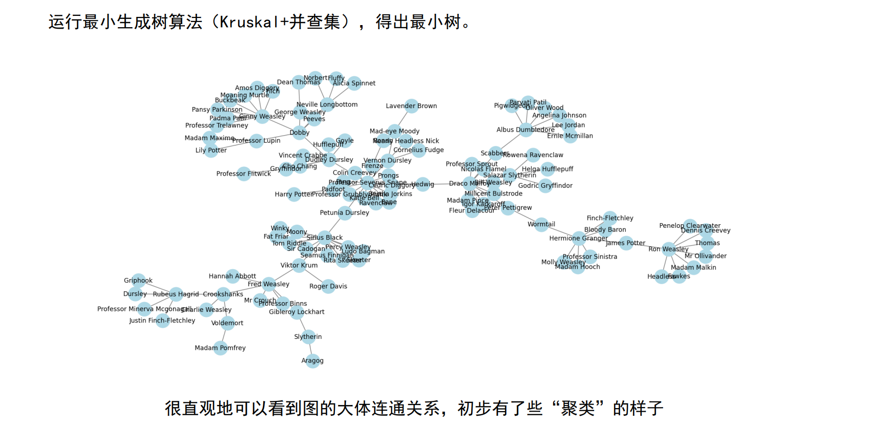
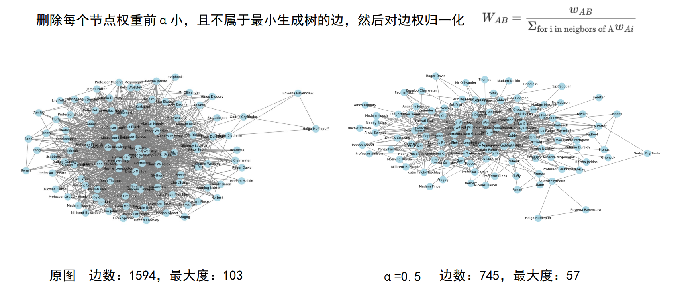
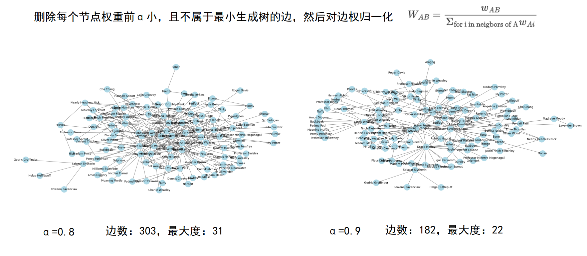

# Task5阶段说明

## 1. 阶段目标
本阶段是可选阶段，你完全可以用`task3`输出作为`task5`的输入，但效果可能**不太好**。

本阶段的目标是对`task3`的输出进行剪枝，过滤掉多余和无用关系，创新性地使用了基于并查集和最小生成树的键值算法。

具体的原理及效果说明可以参见下面的图片说明：












## 2. 运行示例
```bash
python src/task5/run.py --input_dir data/test/output/task3 --output_dir data/test/output/task5
```