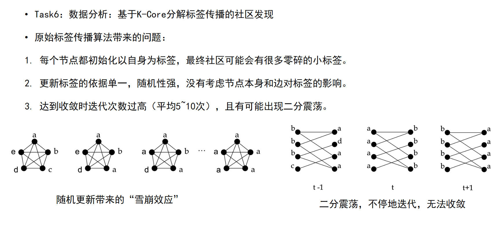
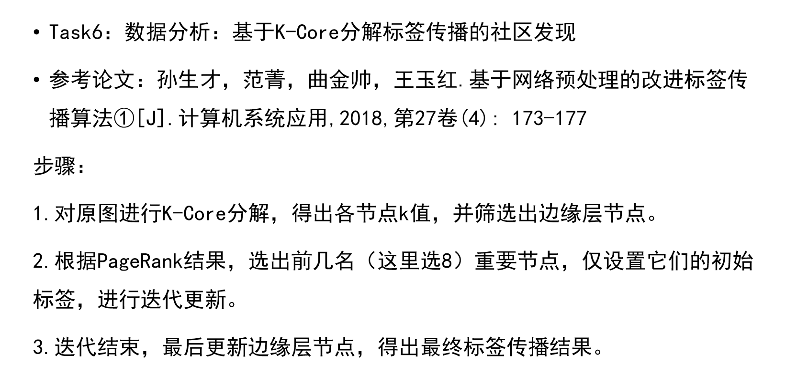

# Task6阶段说明

## 1. 阶段目标

本阶段的目标是，给定一个包含人物同现关系的图，使用标签传播算法对人物进行社区划分。

本阶段创新性地使用了基于`K-core`分解的标签传播算法，引入`节点影响力`为标签传播过程提供依据。

主要参数说明如下：

输入：
+ `--main_character_source`：主要人物来源，标签传播算法需要确定某些节点的初始标签，若为`page_rank`则根据`page_rank_result_dir`中的结果（也即`task4`的输出）确定主要人物，若为`node_influence`则根据关系图计算得来的节点影响力确定主要人物。

+ `--page_rank_result_dir`: `task4`生成的`pagerank`分数结果路径，当`--main_character_source`是`page_rank`时，会读取该文件路径。

+ `--graph_info_dir`: 关系图路径，可以是`task3`的输出，也可以是`task5`的输出。

+ `--save_temp`: 是否保存中间结果，默认是False。

输出：

运行成功后，你将在输出路径下的`labelXX（X是迭代次数）`下的文件看到类似于下面的输出：
```
哈利波特#N#哈利波特
...
```
每行含义为：`人物名#是否为边缘节点#所属社区名`

## 2. 实现原理

可以参考下面的图示：








## 3. 运行示例
```bash
python src/task6/run.py --page_rank_results_dir data/test/output/task4 --graph_info_dir data/test/output/task5 --output_dir data/test/output/task6 --top_k_character 5 --max_iteration 1 --main_character_source page_rank --overwrite Fasle --handle_edge False --save_temp False
```